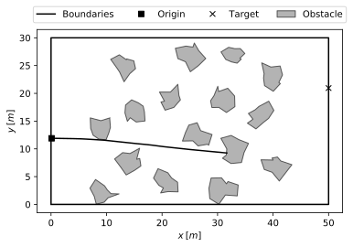
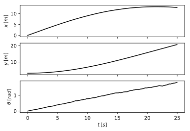
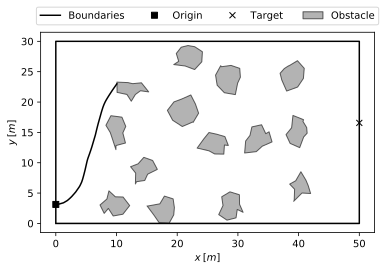
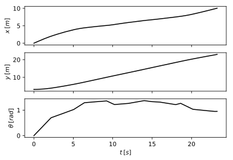

# Robotic Planning Assignment 2018

In this assignment we consider a constant velocity Dubin's car model, in which the steering angle is the sole control parameter, modelled by the following system of ordinary differential equations.


Suppose that we must drive the car between particular positions, while avoiding obstacles (see the diagramme below).


## The Mission

In this assignment we'll work with a `Mission` object, which encapsulates the dynamics and environment of this problem.

### Attributes

`Mission` has four main attributes:
- `origin : np.ndarray(shape=(1,2))`: the initial position of the car, randomly assigned within the area boudaries.
-  `target : np.ndarray(shape=(1,2))`: the target position that the car seeks to drive to.
- `states : np.ndarray(shape=(n,3))`: the record of `n` simulated states, as generated by `step` or `simulate`, where `states[:,0]` is the x-positions, `states[:,1]` is the y-positions, and `states[:,2]` is the heading angles.
- `times : np.ndarray(shape=(1,n))`: the record of `n` simulated times, as generated by `step` or `simulate`


### Methods

`Mission` has five main methods:
- `reset()`: resets `states` and `times`, as well as reinitialises the simulator's current state and time.
- `safe(state)`: given a `state : np.ndarray(shape=(1,3))`, returns `True` if the state is neither outside boundaries or intersecting obstacles, and `False` otherwise.
- `done(state)`: given a `state : np.ndarray(shape=(1,3))`, returns `True` if the position approximately matches the target, such that `np.linalg.norm(state[:2] - target) <= 1e-4`, `False` otherwise.
- `step(control)`: performs one simulation step given a `control : float` between -1 and 1. It returns a `tuple` containing:
  - `state : np.ndarray(shape=(1, 3))`: the new state
  - `time : float`: the new time
  - `safe : bool`: `True` if the `state` is neither outside boundaries or intersecting obstacles, `False` otherwise.
  - `done : bool`: `True` if the new position `state[:2]` matches `target`, `False` otherwise.
- `simulate(controls, times=None)`: resets `states` and `times`, and simulates a whole trajectory, given a control function or a sequence of controls and times, until either `safe == False` or `done == True`. Returns `True` if the simulation finalises with `safe == True` and `done == True`, `False` otherwise.
  - If `control` is a `callable function` of the form `control(time, state)`, the car's trajectory will be simulated with the function computing the control at every moment in time.
  - If `control` and `time` are both sequences where `len(control) + 1 == len(time)`, the car's trajectory will be simulated with each `control[i]` being constant between `time[i]` and `time[i+1]`. The simulation will run until either the final time `time[-1]` is realised or `safe(state) == False`.
- `plot_traj(ax=None)`: plots the car's trajectory and environment to `ax : matplotlib.axes`. If `ax` is given, nothing is returned. If `ax` isn't given, `(fig : matplotlib.figure, ax : matplotlib.axes)` is returned.
- `plot_states(ax=None)`: plots the car's state timeline to `ax : matplotlib.axes`. If `ax` is given, nothing is returned. If `ax` isn't given, `(fig : matplotlib.figure, ax : matplotlib.axes)` is returned.

## The task

Using some robotic planning method, construct either a *control function* or a *control sequence* that drives the car between the origin and target positions without either intersecting obstacles or going outside the boundaries. The attributes and methods of `Mission` will be useful in the construction of your planning method.

### Control function
A `control function` must take as its arguments a `time : float` and a three-dimensional array `state : np.ndarray(shape=(1,3))`. The function must output a `control : float` between -1 and 1.

```python
def control_function(time, state):
  ...
  return control
```

A **successful** `control_function` will drive the car to its target without leaving the boundaries or intersecting any obstacles, such that `Mission.simulate(control_function)` returns with `safe == True` and `done == True`.

Here is an example usage:
```python
def control_function(time, state):
  return np.random.uniform(-0.1, 0.2)

>>> mis = Mission()
>>> mis.simulate(control_function)
False
>>> mis.states
array([[0.00000000e+00, 5.40425397e+00, 0.00000000e+00],
       [3.16227766e-05, 5.40425397e+00, 2.62830879e-06],
       [3.45718816e-05, 5.40425397e+00, 3.47070026e-06],
       ...,
       [9.79142472e+00, 9.95872834e+00, 8.50000949e-01],
       [9.79547327e+00, 9.96334058e+00, 8.50784636e-01],
       [9.80357742e+00, 9.97259665e+00, 8.52930712e-01]])
>>> mis.times
array([0.00000000e+00, 3.16227766e-05, 3.45718816e-05, ...,
       1.11505153e+01, 1.11566524e+01, 1.11689549e+01])
>>> fig1, ax1 = mis.plot_traj()
>>> fig2, ax2 = mis.plot_states()
>>> fig1.show(); fig2.show()
```




### Control sequence
This method requires two one dimensional arrays, one of the `controls` and the other of the `times` at which the controls were executed, where `len(controls) + 1 == len(times)`. Each `controls[i]` is constant between `times[i]` and `times[i+1]`.

Here is an example of a control sequence:
```python
>>> controls = np.random.uniform(-0.1, 0.2, 20)
>>> times    = np.linspace(0, 100, len(controls) + 1)
>>> controls
array([ 0.14871834,  0.00656724,  0.03006482,  0.05878964,  0.09825237,
        0.14870998, -0.09429531,  0.04996116,  0.12422711,  0.19334548,
       -0.08936053,  0.02470106,  0.09150647,  0.12076509, -0.0792684 ,
        0.10179451,  0.15568907,  0.18440924,  0.17841186,  0.13823599,
       -0.05844182, -0.05427012, -0.05521154,  0.12968274,  0.06800895,
        0.09373814, -0.00427508, -0.00085192,  0.00742065,  0.06728603,
        0.01660029,  0.17302113,  0.14712619,  0.12238769,  0.0528882 ,
        0.0483427 ,  0.04361738,  0.02047795,  0.17386578,  0.09157581,
        0.07876335,  0.18299277,  0.18017956,  0.12902431, -0.02671693,
       -0.04925692, -0.02880882, -0.01224276, -0.06387199,  0.13269246])
>>> times
array([  0.,   2.,   4.,   6.,   8.,  10.,  12.,  14.,  16.,  18.,  20.,
        22.,  24.,  26.,  28.,  30.,  32.,  34.,  36.,  38.,  40.,  42.,
        44.,  46.,  48.,  50.,  52.,  54.,  56.,  58.,  60.,  62.,  64.,
        66.,  68.,  70.,  72.,  74.,  76.,  78.,  80.,  82.,  84.,  86.,
        88.,  90.,  92.,  94.,  96.,  98., 100.])
>>> mis = Mission()
>>> mis.simulate(controls, times)
False
>>> fig1, ax1 = mis.plot_traj()
>>> fig2, ax2 = mis.plot_traj()
>>> fig1.show(); fig2.show()
```




This method will be validated by simulating the car with constant controls between the times.
A **successful** control sequence will drive the car to the target without intersecting obstacles.

## API
