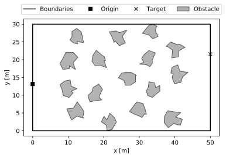
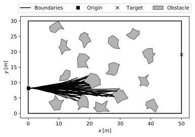

# Robotic Planning Assignment 2018

In this assignment we consider a constant velocity Dubin's car model, in which the steering angle is the sole control parameter, modelled by the following system of ordinary differential equations.


Suppose that we must drive the car between particular positions, while avoiding obstacles (see the diagramme below).



## The code

In this assignment we'll work with a `Mission` object, which encapsulates the dynamics and environment of this problem.

### Attributes
Attribute           | Type                     | Description |
| ----------------- | ------------------------ | ---------------- |
|`Mission.origin`   | `np.ndarray((1,2))`      | Initial position |
|`Mission.target`   | `np.ndarray((1,2))`      | Target position |
|`Mission.state`    | `np.ndarray(shape(1,3))` | Current state, where <li> `state[0]`: horizontal position <li> `state[1]`: vertical position <li> `state[2]`: heading angle|
|`Mission.time`     | `float`                  | Current time |
|`Mission.states`   | `np.ndarray((n,3))`      | Record of `n` states, where: <li> `states[:,0]`: horizontal positions <li> `states[:,1]`: vertical positions <li>`states[:,2]`: heading angles |
|`Mission.times`    | `np.ndarray((1,n))`      | Record of `n` times |
|`Mission.controls` | `np.ndarray((1,n))`      | Record of `n` controls |

### Methods

| Method                      | Arguments | Returns | Notes |
| --------------------------- | --------- | ------- | ----------- |
| `Mission.set(s, t)`         | <li> `s : np.ndarray((1,3))`: state <li> `t : float`: time | None | Sets <li> `Mission.state` to `s` <li> `Mission.time` to `t` |
| `Mission.reset()`           | None  | None | Resets <li>`Mission.state` <li> `Mission.time` <li> `Mission.states` <li> `Mission.times` <li> `Mission.controls` |
| `Mission.record(s, t, u)`   |  <li> `s : np.ndarray((n,3))`: state <li> `t : float or np.ndarray((1,n))`: time <li> `u : float or np.ndarray((1,n))`: control  | None |  Appends <li> `s` to `Mission.states` <li> `t` to `Mission.times` <li> `u` to `Mission.controls` |
| `Mission.safe(p0, p1=None)` |   <li> `p0 : np.ndarray((1,2))`: first position <li> `p1 : np.ndarray((1,2))`: second position |  <li> If only given `p0`: `True` if `p0` is within boundaries and in obstacle free space, `False` otherwise <li> If given both `p0` and `p1`: `True` if line does not intersect neither boundaries nor obstacles, `False` otherwise.|  None |
| `Mission.done(p)`           |  <li> `p : np.ndarray((1,2))`: position  | `True` if `p` is approximately at `Mission.target` |  None |
| `Mission.step(u, Dt=None, inplace=False, verbose=False, record=False)`   | <li> `u : float or callable`: control or control function of the form `control(t, s)` <li> `Dt : float`: duration to simulate <li> `inplace : bool`: set the internal state and time <li> `verbose : bool`: if `True` print simulation information <li> `record : bool`: append `s`, `u`, and `t` to the records | If `u` is a float, tuple containing: <li> `s : np.ndarray((1,3))`: new state <li> `u : float`: control <li> `t : float`: new time <li> `safe : bool`: `True` if transition was safe, `False` otherwise <li> `done : bool`: `True` if new position is approximately at target, `False` otherwise <br><br> If `Dt` is given, tuple containing: <li> `s : np.ndarray((n,3))`: states  <li> `u : np.ndarray((1, n))`: controls  <li> `t : np.ndarray((1,n))`: times <li> `safe : bool`: `True` if transition was safe, `False` otherwise <li> `done : bool`: `True` if new position is approximately at target, `False` otherwise | <li> If `inplace` is `True` than the final state and time are set. <li> If `verbose` is `True`, the state and time are shown.|

### Implementation
The `Mission` API, as described above, allows one to flexibly test planning methods. Let's walk through how to use it.

First of all, we need to import the module for this assignment, after which we can instantiate the `Mission` object.
```python
# import necessary module
from rplplanning2018 import mission
# instantiate mission object
mis = Mission()
```

We can plot the environment to get more of a sense of it
```python
>>> fig, ax = mis.plot_traj()
>>> fig.show()
```


For demonstration, let's consider a constant control and a control function
```python
import numpy as np
# constant control
u = np.random.uniform(-0.1, 0.1)
# control function
uf = lambda t, s: np.random.uniform(-0.1, 0.1)
```

With either of these we can simulate one step in time, with the time-step size determined by an adaptive numerical integrator, or to a user specified duration, as shown
```python
>>> mis.step(u)
(array([ 0.1704, 23.6773, -0.0011]),
 -0.017698276623792975,
 0.07042401979601698,
 True,
 False)

>>> mis.step(uf)
(array([ 0.1704, 23.6772, -0.0025]),
 -0.03742425078813959,
 0.07042401979601698,
 True,
 False)

```

We can also step for a specific duration, e.g. one second
```python
>>> mis.step(u, Dt=1)
(array([[ 0.1   , 23.6773,  0.    ],
        [ 0.1764, 23.6772, -0.0015],
        [ 0.2528, 23.6771, -0.0028],
        [ 0.3528, 23.6767, -0.0046],
        [ 0.4528, 23.6762, -0.0064],
        [ 0.5528, 23.6754, -0.0082],
        [ 0.6528, 23.6745, -0.0099],
        [ 0.7528, 23.6734, -0.0117],
        [ 0.8528, 23.6722, -0.0135],
        [ 0.9528, 23.6707, -0.0152],
        [ 1.0528, 23.6691, -0.017 ],
        [ 1.0999, 23.6683, -0.0178]]),
 array([-0.0177, -0.0177, -0.0177, -0.0177, -0.0177, -0.0177, -0.0177,
        -0.0177, -0.0177, -0.0177, -0.0177]),
 array([0.    , 0.0764, 0.1528, 0.2528, 0.3528, 0.4528, 0.5528, 0.6528,
        0.7528, 0.8528, 0.9528, 1.    ]),
 True,
 False)
```
With `Mission.step` we can use the `inplace` argument to internally set the final conditions as well
```python
>>> mis.state, mis.time
(array([ 0.1   , 12.5701,  0.    ]), 0.0)
>>> state, control, time, safe, done = mis.step(u, Dt=1)
>>> mis.state, mis.time
(array([ 0.1   , 12.5701,  0.    ]), 0.0)
>>> state, control, time, safe, done = mis.step(u, Dt=1, inplace=True)
>>> mis.state, mis.time
(array([ 1.1   , 12.5771,  0.0179]), 1.0)
>>> mis.reset()
>>> mis.state, mis.time
(array([ 0.1   , 12.5701,  0.    ]), 0.0)
```

One can keep track of the car's trajectory either trough the `step` or `record` as such
```python
>>> fig, ax = mis.plot_traj()
>>> fig, ax = mis.plot_records()
>>> for i in range(20):
        mis.step(uf, Dt=50, record=True)
        mis.plot_traj(ax)
        mis.reset()
>>> fig.show()
```


It should be noted here that the step stops once either `safe` is `False` or `done` is `True`.

## The task

Using some robotic planning method, utilise the above attributes and methods of the `Mission` object to write a Python script that effectively drives the car between the origin and target.

Create a script like function that returns the `Mission` object with its records `Mission.states`, `Mission.times`, and `Mission.controls` fully populated. Your function should look something like this:

```python
import Mission, numpy as np
def main():
  # instantiate mission
  mis = Mission()

  # do stuff
  ...
  ...
  ## maybe some RRTs
  ...
  ...

  return mis
```

### Validation
A **succesful** function will return a squence of states, time, and controls which together are dynamically feasible, collision free, and arrive to the target.
.
